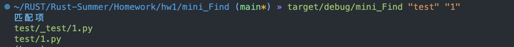
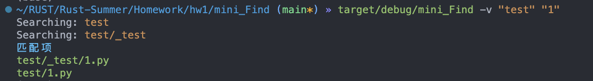

### Mini_Find

##### Description

* 彩色输出
* 可选参数
* 代码重构

##### Build

```shell
cargo build
```

##### Run

```shell
target/debug/mini_Find [-v/--verbose] "目标目录" "正则式"
```

##### Result



​	通过增加`-v`来输出遍历的文件夹，


